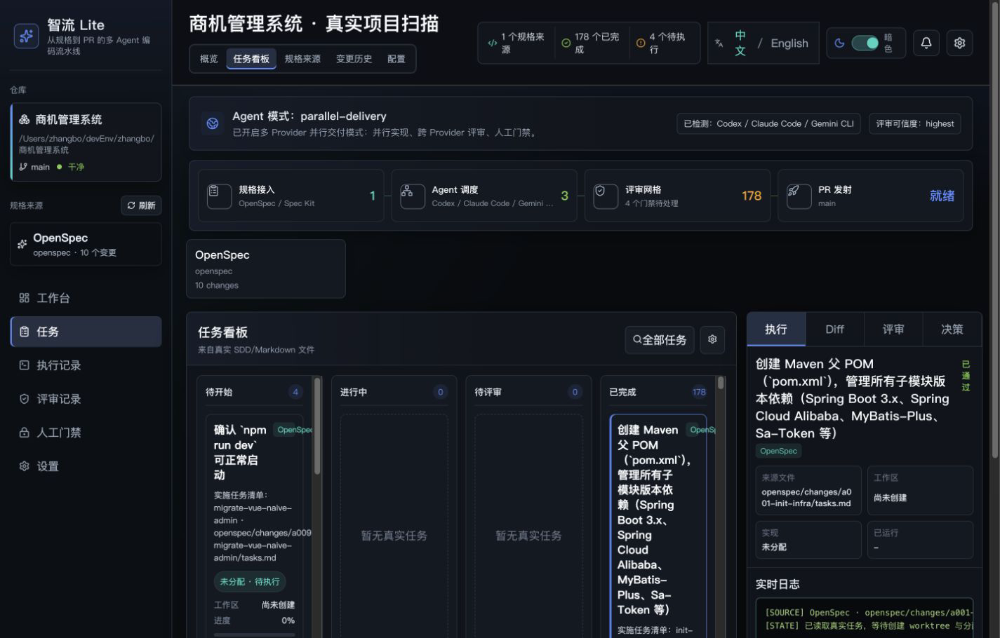
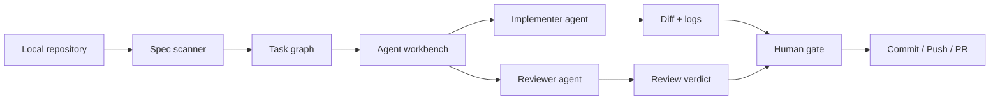

# ZhiFlow Lite

> Local-first Spec-to-PR workbench for developers who run Codex, Claude Code, Gemini CLI, and other coding agents.

[](https://github.com/Boscodoggggg/ZhiFlow/actions/workflows/ci.yml)
[](LICENSE)
[](#why-zhiflow)

ZhiFlow Lite turns real project specs into an execution workspace: scan OpenSpec, Spec Kit, or plain `tasks.md`, map the work into agent-ready tasks, review the output, and keep humans in control before code reaches a PR.



## Why ZhiFlow

Modern coding agents are powerful, but the workflow around them is still messy:

- specs live in one place, agent sessions in another
- one agent can implement code, but another agent should review it
- worktrees, diffs, logs, and PR readiness are scattered across terminals
- teams need human gates before commit, push, and PR

ZhiFlow Lite is the local-first control plane for that loop.

## Highlights

- **Real project scanning**: no demo data; reads the project you point it at
- **SDD-compatible**: supports OpenSpec, Spec Kit, and Markdown `tasks.md`
- **Multi-agent ready**: designed for implementer agents, reviewer agents, and parallel task lanes
- **Provider aware**: detects local Codex, Claude Code, Gemini CLI, OpenCode, and Cursor CLIs
- **Human gate first**: PR, push, and final decisions are designed to require explicit human approval
- **Bilingual UI**: Simplified Chinese by default, English supported
- **Theme support**: polished dark and light modes

## Current Status

Early preview. The current app focuses on:

- scanning real repositories
- visualizing spec/task sources
- showing multi-agent execution lanes
- previewing worktree / PR gates
- proving the UX shape before deeper automation lands

See [Roadmap](docs/ROADMAP.md) for the next milestones.

## Quick Start

```bash
npm install
npm run dev:app
```

Open:

```text
http://127.0.0.1:5173/
```

Scan another local project:

```bash
ZHIFLOW_PROJECT=/path/to/your/project npm run dev:app
```

Use another port:

```bash
PORT=5174 ZHIFLOW_PROJECT=/path/to/your/project npm run dev:app
```

## Supported Spec Sources

| Source | Path Pattern | Status |
| --- | --- | --- |
| OpenSpec | `openspec/changes/*/{proposal.md,design.md,tasks.md}` | Supported |
| Spec Kit | `specs/*/{spec.md,plan.md,tasks.md}` | Supported |
| Markdown | `tasks.md` | Supported |
| ZhiFlow native spec | `.zhiflow/**` | Planned |

## Architecture



## Development

```bash
npm test
npm run build
```

## 中文简介

ZhiFlow Lite 是一个本地优先的 Spec-to-PR 多 Agent 工作台。它会读取你真实项目里的 OpenSpec、Spec Kit 或 `tasks.md`，把规格任务变成可执行队列，并为多 Agent 实现、交叉评审、人工门禁和 PR 流程提供统一界面。

目标不是做一个静态看板，而是做一个真正能把规格推进到 PR 的本地控制台。

## Contributing

The project is young, sharp edges included. Issues, ideas, and focused PRs are welcome. Start with [CONTRIBUTING.md](CONTRIBUTING.md).

## License

MIT
